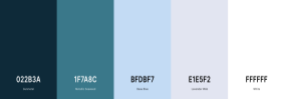

# WILD SWIM BRISTOL
## Table of contents:
1. Project Goals
1.1 Reasons for website
1.2 Goals

2. User Experience 
2.1 User stories
2.2 Design
2.3 Wireframes

3. Features 
4. Technologies used 
5. Testing
6. Deployment
7. Credits

# 1. Project Goals
## 1.1 Reason for website:
1. There are no websites available for swim spots specifically in Bristol, UK. 
2. Swimmers should not be swimming without safety information.
3. There are benefits to swimming in the wild both mentally and physically and this website will hopefully encourage people to try wild swimming. 

## 1.2 Goals:
1. Build a website for people in Bristol to be able to find wild swimming spots. 
2. Provide information on kit and safety. 
3. Connect swimmers in Bristol.
Get people swimming for mental and physical health benefits. 

# 2. User Experience

## 2.2 User Stories
1. As a wild swimmer, I want recommendations for wild swim spots in/near Bristol so I can decide to visit new locations. 

2. As a wild swimmer, I want travel information including maps and detailed instructions, so I can find remote spots more easily. 

3. As a new swimmer, I want social media groups so I can connect with other swimmers. 

4. As a new swimmer, I want to access safety information so I can be more informed about swimming in the wild. 

5. As a new swimmer, I want information on the kit I need to go swimming so I can make sure I am prepared. 

6. As a new swimmer, I want to feel confident and excited about swimming when I read this website. 

7. As a user, I want the WILD SWIM BRISTOL to responsive so I can use the site on different devices. 

8. As a user, I want the WILD SWIM BRISTOL to have a clear layout and navigation so I can the find information I need easily. 

## 2.2 Design

WILD SWIM BRISTOL website has a clean, fresh design. It should be eye catching but not distracting from the content. 

### Font
The header font is [Raleway](https://fonts.google.com/specimen/Raleway?query=raleway) and the main font is [Montserrat](https://fonts.google.com/specimen/Montserrat?query=mont). Along with their bold versions,both of these fonts have been imported from Google Fonts. 
Raleway has been used to sytle the SWIM WILD BRISTOL logo as well as the headings. Both fonts are attractive, modern and easy to read. 

### Color Scheme 

The colors were generated to be inspiring for people who are interested in getting into wild swimming and spending time in nature. They are mainly blues and greens for this reason. 

### Logo

## 2.3 Wireframes

|    Desktop   |    Tablet    |    Mobile    |
|    :----:    |     :----:   |    :----:    |
|[Home Page](wireframes/home_desktop.png)|[Home Page](wireframes/home_tablet.png)|[Home Page](wireframes/home-mobile.png)|
|[Swim spots Page](wireframes/swimspots_desktop.png)|[Swim spots Page](wireframes/swimspots_tablet.png)|[Swim spots Page](wireframes/swimspots_mobile.png)|
|[Swim Safety Page](wireframes/swimsafety_desktop.png)|[Swim Safety Page](wireframes/swimsafety_tablet.png)|[Swim Safety Page](wireframes/swimsafety_mobile.png)|
|[Get Started Page](wireframes/getstarted_desktop.png)|[Get Started Page](wireframes/getstarted_tablet.png)|[Get Started Page](wireframes/getstarted_mobile.png)|

Prototype of the desktop design can be seen on [Figma](https://www.figma.com/proto/yjSNSplwMUmh46eKfheASs/Wild-Swim-Bristol?page-id=0%3A1&node-id=11%3A0&viewport=3677%2C-2357%2C0.9432434439659119&scaling=min-zoom), where the designs where produced. 

# 3. Features

## Header
* WILD SWIM BRISTOL logo (links to homepage when clicked) .
* Navagation links to the rest of the site. 

## Footer
* Link to top of page.

Both the header and footer are consistent on every page of the site. 

## Homepage

* Links to each page of the site with a brief description of what that page will contain.
*  CTA to take users to the site pages.
* Reminder to leave no trace and respect nature.

## Swim Spot page
* **Spot Description** - Information about the site including why to visit and what facilities are available. 
* **Image of location** - Image of location is the background for each description. 
* **Location** - Directions, Google maps and address for each swim spot. 
* **Saftey reminder** - Safety block to remind users to visit the safety page of the site. 

## Swim Safety page

* Safety tips
* Safety video
* Temperature guide
* Information on swimming lessons

## Get Started page 
* Reasons to start swimming 
* Video of wild swimming
* Kit list
* Kit video
* Social media links for wild swim groups

# 4. Technologies used 
* [HTML5](https://en.wikipedia.org/wiki/HTML5) - Content and structure
* [CSS](https://en.wikipedia.org/wiki/CSS) - Style my website
* [Gitpod](https://www.gitpod.io/) - Coding workspace
* [Github/ Github pages](https://github.com/)- Commit and deploy my code
* [Coloors](https://coolors.co/) - Color generator
* [WebAim](https://webaim.org/resources/contrastchecker/) - Color contract check
* [Figma](https://www.figma.com/about/) - Design wirframes and prototypes
* [Font Awesome](https://fontawesome.com/) - Embed icons.
* [Google Fonts](https://fonts.google.com/) - Select and embed fonts
* [Am I responsive?](http://ami.responsivedesign.is/#)- To see display the website as mock ups  

## 5. Testing
You can view the testing for this website [here.](testing.md) 
## 6. Deployment

How I deploy to Github pages for the first time:

Go to [GitHub.com](Github.com)

1. Log into Github account

2. Click on ‘Repositories’

3. Click on 'wild-swim-bristol Project’

4. Click on ‘Settings’

5. Go to ‘Github Pages’ section.

6. Under the ‘Source’ select ‘Master Branch’. Then click 'save'

7. Refresh page and scroll to 'Github pages' and you will find a link has been created. The websit is deployed.

More information on how to deploy to Github pages can be found [here](https://docs.github.com/en/pages/getting-started-with-github-pages/configuring-a-publishing-source-for-your-github-pages-site).

To clone the site:

1. Select the 'wild-swim-bristol' repository.
2. Click on ‘Clone or download’
3. Click on the clipboard icon
4. Open repo or create new repo
5. Open terminal
6. Type git clone and paste URL link and press enter.

## 7. Credits
* [Rachel Andrews](https://www.youtube.com/c/EverydayAthleteRach/about) for her wild swim kit video. 
* [RNLI](https://rnli.org/) for their swim safety video.
* My mentor[Precious](https://www.linkedin.com/in/precious-ijege-908a00168/?originalSubdomain=ng) for your help and guidance. 
* [Code Institute](https://codeinstitute.net/) student support, slack community and tutorials. 
 