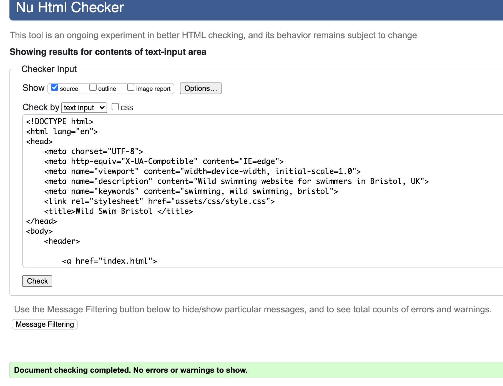
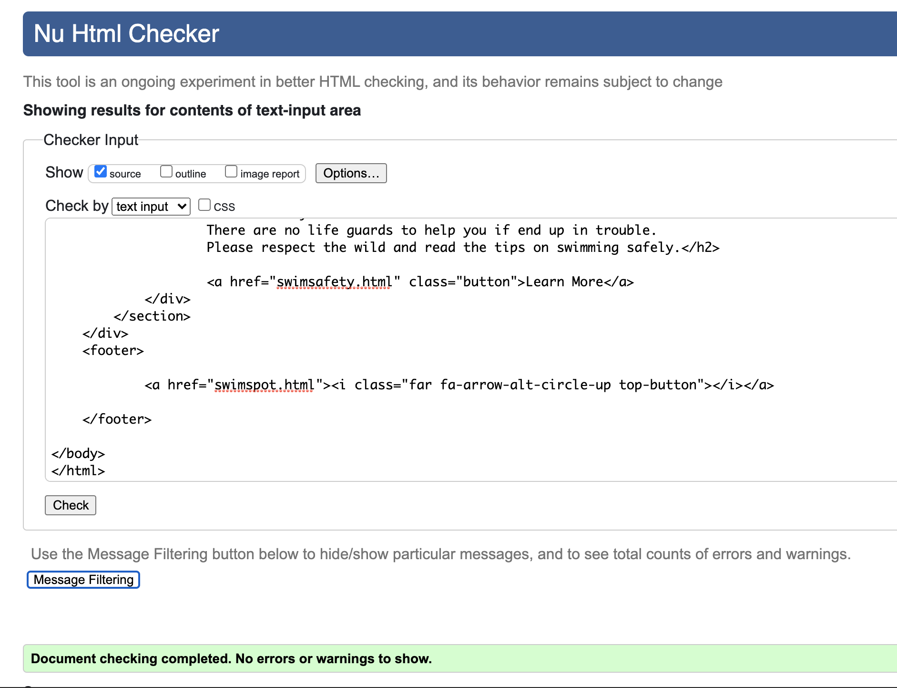
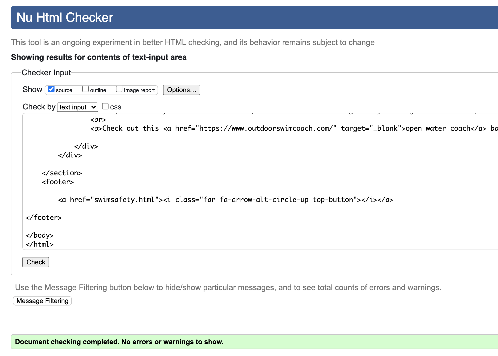
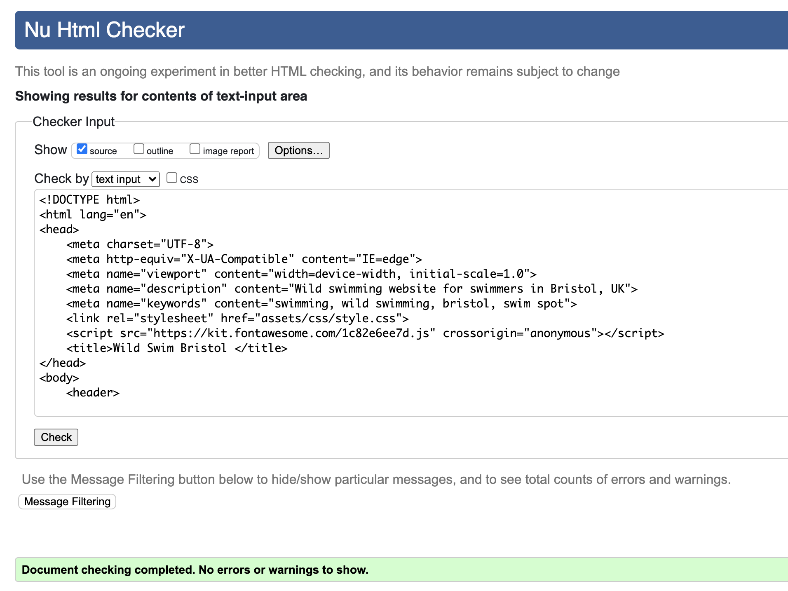
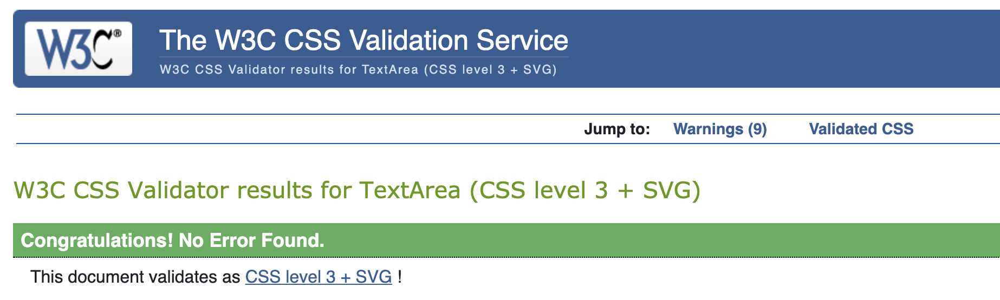

# Testing for WILD SWIM BRISTOL

## Used [W3C HTML validator](https://validator.w3.org/#validate_by_input) to check HTML content for each page.

## index.html

## swimspot.html

## swimsafety.html

## index.html

##Used [W3C CSS Validator](https://jigsaw.w3.org/css-validator/#validate_by_input) to test CCS stylesheet.

## CSS Stylesheet

